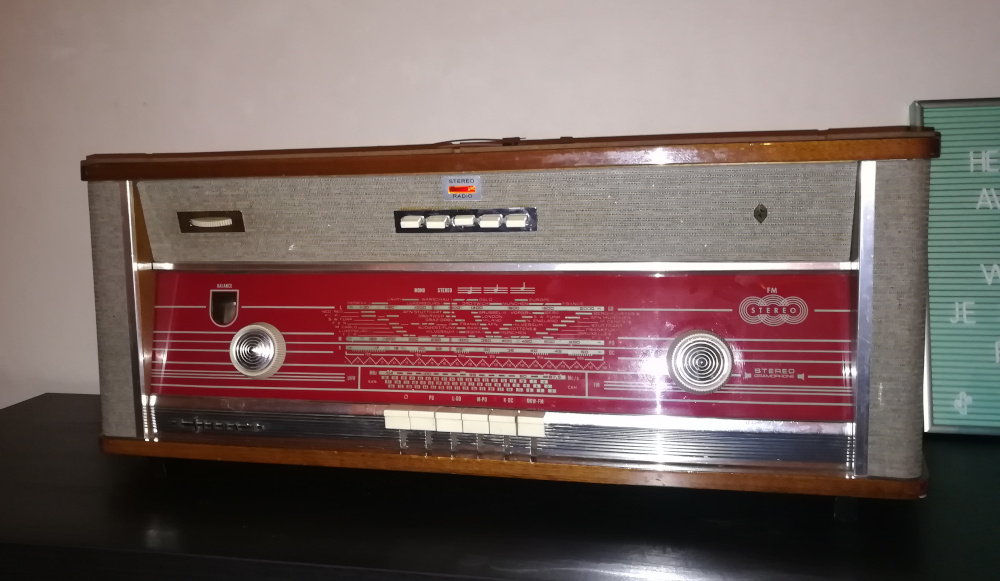

# mopidy-radio
Python script for controlling KODI on my raspberry pi with connected hardware



## Dependencies:
- kodi
- python pip
- websocket-client
- kodi-json

```bash
sudo apt-get -y update
sudo apt-get -y install kodi
sudo apt-get -y install python-pip
pip install kodi-json 
pip install websocket-client
```

## Mount synology NAS: 

```bash
sudo nano /etc/fstab

add: 
//nas/music  /mnt/music/  cifs  user=music,password=xxxxxx,vers=1.0,_netdev,x-systemd.automount  0  0
//nas/raspberypi/siera /home/pi/siera/  cifs  user=pi,password=xxxxxx,vers=1.0,_netdev,x-systemd.automount  0  0
 
```


## Autostart: 
```bash
sudo crontab -e

add: @reboot python /home/pi/siera/main.py no_socket >>/home/pi/siera.log 2>&1 
```
